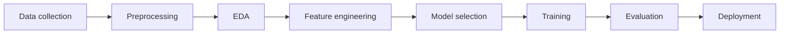

# Week 02 – Linear Regression

## Key concepts

- ML subdomains (recap)
- ML project workflow
- Linear regression (with example)
- Error metrics: MSE, MAE, RMSE
- Multiple linear regression
- Project setup with Poetry (numpy, pandas, scikit-learn, seaborn, matplotlib)

## What I learnt

### 1. ML subdomains

The main types of machine learning:

- **Supervised learning** – Learns from labelled data (input + correct answer). Used for prediction and classification. Example: spam vs not-spam email.
- **Unsupervised learning** – Learns from unlabelled data by finding hidden patterns or groups. Example: customer segmentation.
- **Semi-supervised learning** – Uses a small amount of labelled data together with a large amount of unlabelled data. Sits between supervised and unsupervised. Example: labelling a few images and letting the model use many unlabelled ones to improve.
- **Reinforcement learning** – Learns by trial and error through rewards and penalties. Example: a game-playing agent or a robot learning to walk.

### 2. ML project workflow

A typical ML project moves through these stages in order:

1. **Data collection** – Gather raw data from files, databases, APIs, or sensors.
2. **Preprocessing** – Clean the data: handle missing values, remove duplicates, fix types, scale/normalise.
3. **EDA (Exploratory Data Analysis)** – Explore the data with stats and plots to understand distributions, relationships, and outliers.
4. **Feature engineering** – Create, transform, or select the input variables (features) that best help the model learn.
5. **Model selection** – Choose the algorithm that fits the problem (e.g. linear regression for a continuous target).
6. **Training** – Feed the training data to the model so it learns the patterns (the rules).
7. **Evaluation** – Measure performance on unseen test data using suitable metrics.
8. **Deployment** – Put the trained model into real use so it can make predictions on new data.



### 3. Linear regression

Linear regression is a **supervised learning** algorithm used to predict a **continuous** value. It assumes a straight-line (linear) relationship between the input (x) and the output (y).

The model equation for one input:

```
y = m·x + c
```

- `y` – predicted output
- `x` – input feature
- `m` – slope (how much y changes when x changes)
- `c` – intercept (value of y when x = 0)

Training means finding the best `m` and `c` so the line fits the data as closely as possible.

**Example:** Predicting house price from house size.

| Size (sq ft) | Price (Rs. '000) |
|--------------|------------------|
| 500          | 2,000            |
| 1,000        | 3,500            |
| 1,500        | 5,000            |

The model learns a line through these points, and can then predict the price of a 1,200 sq ft house it has never seen.

### 3.1 MSE (Mean Squared Error)

The average of the squared differences between actual and predicted values.

```
MSE = (1/n) · Σ (yᵢ − ŷᵢ)²
```

- Squaring punishes large errors more heavily.
- Always positive; lower is better.
- Units are squared (e.g. price²), so a bit harder to interpret directly.

### 3.2 MAE (Mean Absolute Error)

The average of the absolute differences between actual and predicted values.

```
MAE = (1/n) · Σ |yᵢ − ŷᵢ|
```

- Treats all errors equally (no squaring).
- Same units as the target, so easy to interpret.
- Less sensitive to outliers than MSE.

### 3.3 RMSE (Root Mean Squared Error)

The square root of MSE.

```
RMSE = √MSE
```

- Brings the error back to the original units of the target.
- Still punishes large errors (because it comes from MSE), but is easier to read than MSE.

**Quick comparison:**

| Metric | Punishes big errors? | Same units as target? |
|--------|----------------------|-----------------------|
| MSE    | Yes (strongly)       | No (squared)          |
| MAE    | No (equal weight)    | Yes                   |
| RMSE   | Yes                  | Yes                   |

### 4. Multiple linear regression

An extension of linear regression that uses **more than one input feature** to predict the output.

```
y = b₀ + b₁·x₁ + b₂·x₂ + … + bₙ·xₙ
```

- `b₀` – intercept
- `b₁ … bₙ` – coefficients (one per feature)
- `x₁ … xₙ` – input features

**Example:** Predicting house price from size **and** number of bedrooms **and** location — instead of just size. Each feature gets its own coefficient showing how much it influences the price.

### 5. Project setup (environment + Poetry)

**Poetry** is a tool for managing Python dependencies and virtual environments.

Basic setup steps:

```bash
# 1. Create a new project
poetry new ml-linear-regression
cd ml-linear-regression

# 2. Add the libraries needed
poetry add numpy pandas scikit-learn seaborn matplotlib

# 3. Activate the environment
poetry shell
```

**Libraries used:**

- **numpy** – numerical arrays and math operations
- **pandas** – loading and handling tabular data (DataFrames)
- **scikit-learn** – the ML models and metrics (linear regression, MSE, etc.)
- **seaborn** – statistical plotting (built on matplotlib)
- **matplotlib** – general plotting and charts

### 6. Small practice project – reading data with pandas

I made a small project, loaded a dataset, and practised pulling data out of it using pandas commands.

```python
import pandas as pd

# Load the dataset from a CSV file
df = pd.read_csv("data.csv")

# First 5 rows
df.head()

# Shape (rows, columns)
df.shape

# Column names and data types
df.info()

# Basic statistics for numeric columns
df.describe()

# Select a single column
df["price"]

# Select multiple columns
df[["size", "price"]]

# Filter rows by a condition
df[df["size"] > 1000]

# Check for missing values
df.isnull().sum()
```