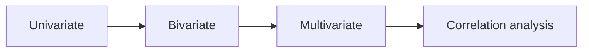
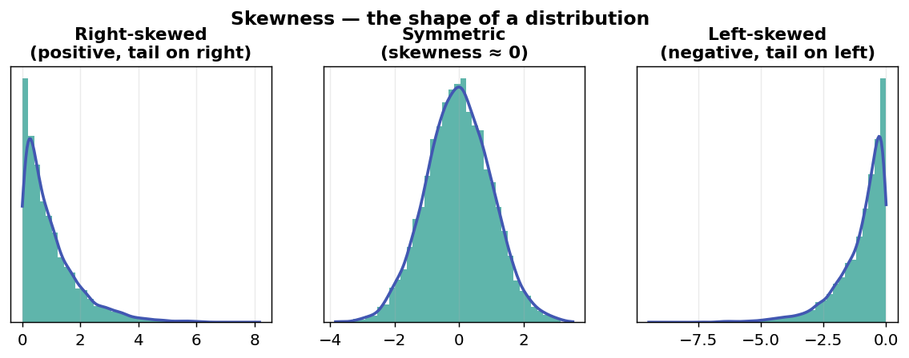
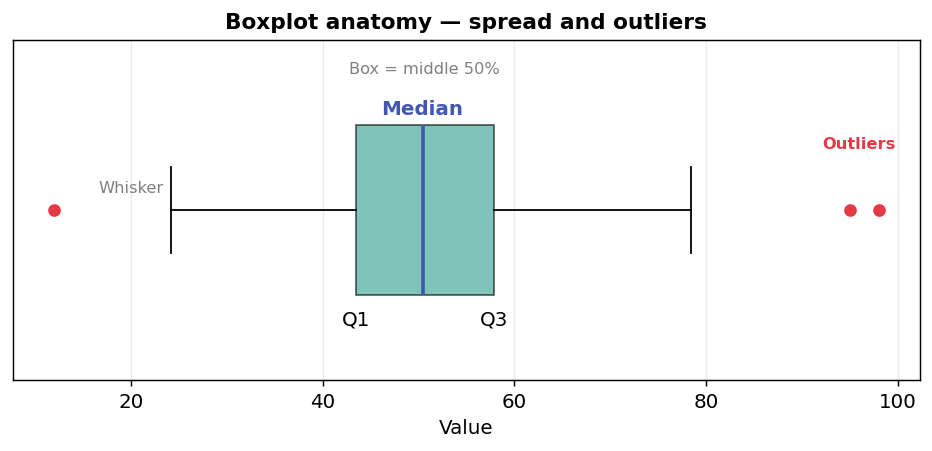
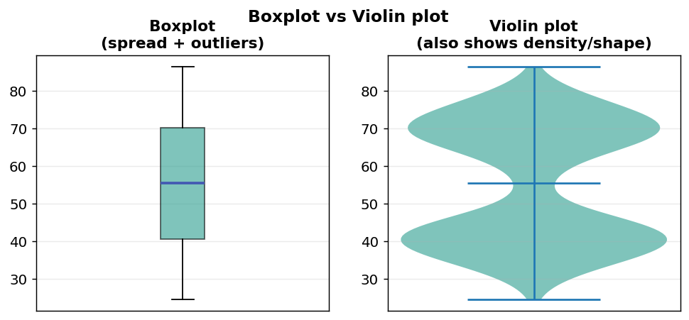
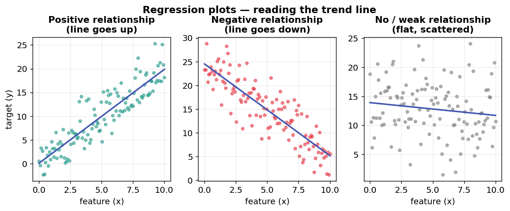
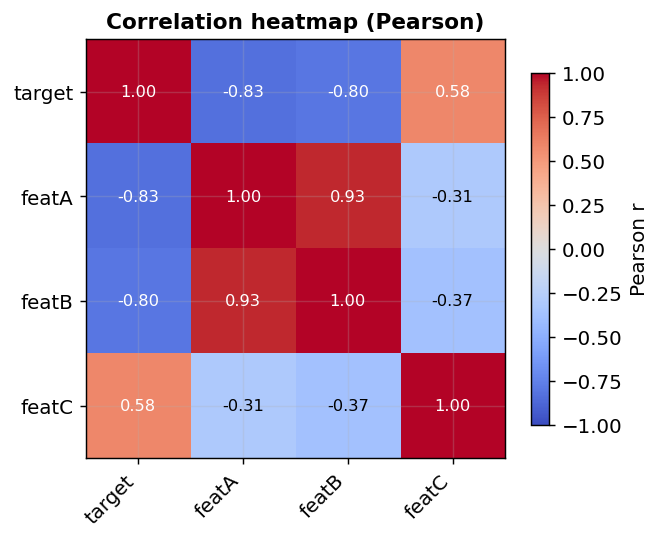
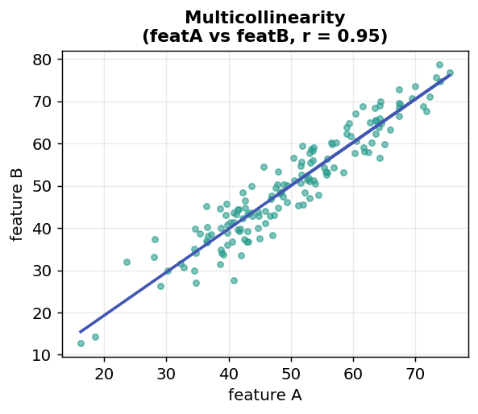
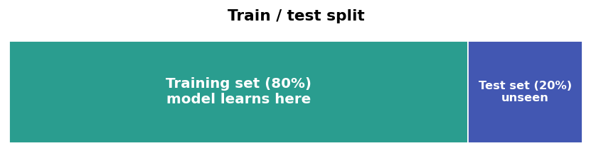

# Week 02 – Exploratory Data Analysis (EDA)

## Key concepts

- What EDA is and why it matters
- Variable types (quantitative vs qualitative)
- The four stages of EDA (univariate, bivariate, multivariate, correlation)
- Skewness
- Plots: boxplot, scatterplot, violin plot, regression plot, pairplot
- Correlation analysis & Pearson correlation heatmap
- Reading correlations (positive / negative / no or weak relationship)
- Multicollinearity
- Train / test split (why we hold out data)

## What I learnt

### 1. What is EDA?

**Exploratory Data Analysis (EDA)** is the step where you explore a dataset with statistics and plots *before* building a model. The goal is to understand the data — its distributions, relationships, and outliers — so you can clean it properly and choose the right features and model.

EDA is usually carried out in **four stages**:

1. **Univariate** – looking at one variable at a time.
2. **Bivariate** – a feature against the target (two variables).
3. **Multivariate** – many features together at once.
4. **Correlation analysis** – measuring the numeric strength of linear relationships.

### 2. Variable types

Before analysing, it helps to classify each variable conceptually:

- **Quantitative** (numeric)
  - **Continuous** – can take any value in a range (e.g. weight, temperature).
  - **Discrete** – countable whole values (e.g. number of doors).
- **Qualitative** (categorical)
  - **Ordinal** – categories with a natural order (e.g. small < medium < large).
  - **Nominal** – categories with no order (e.g. car name, colour).

Knowing the type tells you which plots and which encoding/scaling make sense.

### 3. Univariate analysis (one variable at a time)

The aim is to understand the **shape, spread, and outliers** of each single variable.

**Distribution shape:**
- **Histogram** – bars showing how often values fall into ranges (bins).
- **KDE curve** – a smooth curve laid over the histogram to show the distribution shape more clearly.

**Skewness** – a number describing how lopsided a distribution is:
- **Right-skewed (positive)** – a long tail of large values on the right.
- **Left-skewed (negative)** – a long tail of small values on the left.
- **Symmetric** – skewness close to 0 (balanced on both sides).

As a rough guide, the further skewness is from 0, the more lopsided the distribution — and heavily skewed features may need transforming later.

**Spread & outliers:**
- **Boxplot** – shows the median, the middle 50% of data (the box), the typical range (whiskers), and marks **outliers** as separate points. Great for spotting extreme values quickly.
- **Violin plot** – like a boxplot but also shows the full distribution *density* (fatter where more data sits), combining spread + shape in one view.

### 4. Bivariate analysis (feature vs target)

Here you look at **two variables together**, usually each feature against the target, to check for a relationship.

- **Scatter plot** – plots each data point as (x, y). The pattern of the cloud shows whether a relationship exists.
- **Regression plot (regplot)** – a scatter plot **with a fitted straight line** (and a shaded confidence band). The slope of the line shows the direction and strength of a linear relationship:
  - Line going **up** → positive relationship.
  - Line going **down** → negative relationship.
  - Flat / very scattered → weak or no linear relationship.

### 5. Multivariate analysis (many variables at once)

- **Pairplot** – a grid of scatter plots showing **every pairwise relationship** between variables at the same time, with each variable's distribution along the diagonal.
- It's useful not just to see how features relate to the target, but also how features relate **to each other** — which is how you first spot **multicollinearity** (see below).

### 6. Correlation analysis

Correlation puts a **number** on the strength and direction of a *linear* relationship between two variables.

**Pearson correlation** ranges from **−1 to +1**:
- **+1** – perfect positive linear relationship (both increase together).
- **0** – no linear relationship.
- **−1** – perfect negative linear relationship (one increases as the other decreases).

Rough reading of the magnitude:

| Absolute value | Strength         |
|----------------|------------------|
| 0.7 – 1.0      | Strong           |
| 0.4 – 0.7      | Moderate         |
| 0.0 – 0.4      | Weak / none      |

- A **negative** correlation means the two move in opposite directions.
- A value near **0** means **no strong relationship** — the variables don't move together linearly.

**Heatmap** – a coloured grid of all the correlation values at once. Colour intensity makes it easy to see which pairs are strongly (positively or negatively) related. This is the standard way to visualise a Pearson correlation matrix.

### 7. Multicollinearity

**Multicollinearity** happens when **two or more input features are strongly correlated with each other** (not just with the target).

- You spot it in the pairplot (features tracking each other) and confirm it in the correlation heatmap (high correlation between feature pairs).
- **Why it's a problem:** when features overlap heavily, they carry the same information, so the model can't cleanly tell how much each one contributes. The individual coefficients become unstable and hard to interpret.
- **What to do about it:** drop or combine correlated features, or use regularised models like **Ridge / Lasso** regression.

### 8. Train / test split

To judge a model honestly, you don't test it on the same data it learned from.

- **Training set** – the data the model learns the patterns from.
- **Test set** – data **held out** and never seen during training, used only to measure performance on "unseen" examples.
- A common split is **80% train / 20% test**.
- If the model does well on training data but poorly on test data, it's **overfitting** (memorising instead of generalising). Train and test scores being **close together** is a good sign.

## Summary

- **EDA** = understanding the data before modelling, in four stages: univariate → bivariate → multivariate → correlation.
- Classify **variable types** first (quantitative/qualitative) to pick the right tools.
- **Univariate:** histogram/KDE for shape, **skewness** for lopsidedness, **boxplot & violin plot** for spread and outliers.
- **Bivariate:** **scatter plot** and **regplot** to see feature-vs-target relationships.
- **Multivariate:** **pairplot** for all relationships at once.
- **Correlation:** Pearson correlation (−1 to +1) shown as a **heatmap**; watch for negative, weak/no, and strong relationships.
- **Multicollinearity:** features correlated with *each other* — makes coefficients unreliable.
- **Train/test split:** hold out data to check the model generalises and isn't overfitting.
